# 前端面试题库 · FE Interview Bank

> 🐙 **GitHub**：[github.com/jycao2/fe-interview-bank](https://github.com/jycao2/fe-interview-bank) ｜ 作者：[jycao2](https://github.com/jycao2) ｜ 📦 **[下载 Windows EXE（v1.0.0）](https://github.com/jycao2/fe-interview-bank/releases/tag/v1.0.0)**

一个基于 **Vue 3 + Vite + Pinia + Vue Router** 的前端技术总结与面试题库项目，收录覆盖全面的前端面试题与**详尽答案解析**，支持分类浏览、全文搜索、难度筛选、收藏、深色模式，**代码块高亮 + 一键复制 / 在线运行**，**LeetCode 风格算法实战 · 在线判题（200 题三难度）**，以及 **统一错题集（模拟考试选择题 + 算法实战手写题，浏览器永久存储 / 历史记录 / 一键生成新考试）**。

> 📊 当前共 **15 个分类 · 514 道题** + 模拟考试 **138 道选择题** + **算法实战 200 道手写题**（简单 / 中等 / 困难三难度），持续扩充中。
> 📦 不想安装环境？直接下载免安装桌面版：**[前端面试题库-1.0.0-x64-portable.exe](https://github.com/jycao2/fe-interview-bank/releases/tag/v1.0.0)**（70 MB，双击即用）

---

## ✨ 功能特性

### 核心功能
- 🗂️ **分类导航**：HTML / CSS / JavaScript / TypeScript / Vue / React / 浏览器原理 / 计算机网络 / 性能优化 / 工程化 / 数据结构与算法 / 手写代码 / AI 编程 / GIS 地理信息 / **移动端 H5 · 小程序 · uni-app**，共 15 个方向。
- 🔍 **全文搜索**：对题目、标签、答案内容做关键词检索。
- 🎯 **难度筛选**：简单 / 中等 / 困难三级过滤。
- ⭐ **收藏夹**：本地持久化（localStorage），随时回顾重点题目。
- 🌙 **深色模式**：跟随系统或手动切换，主题 CSS 变量一键换肤。
- 📱 **响应式布局**：桌面与移动端均适配。
- 🔗 **上下题导航 + 关联推荐**，便于连贯学习。
- 📝 **Markdown 富文本渲染**：答案支持代码块、表格、引用、列表等。
- 📝 **模拟考试（进阶）**：从 138 道选择题题库**按分类权重 + 难度比例**抽取 30 题，支持「简单/均衡/困难」三档模式、可选指定分类，交卷即时出分，附**分类 + 难度分布统计**、错题解析与正确答案对照；交卷时自动同步至错题集。
- 💻 **算法实战 · 在线判题**：**200 道** LeetCode 风格手写算法题，覆盖**简单 / 中等 / 困难三档难度**，分类涵盖数组 / 字符串 / 数学 / 栈队列 / 二分 / 排序 / DP / 滑动窗口 / 回溯 / 链表 / 树 / 图等，浏览器内 **Web Worker 沙箱**执行用户代码，**5 秒超时保护**，自动比对测试用例并通过/失败判定，支持题解查看、复杂度提示、答题进度统计；运行结果自动同步至错题集。
- ❌ **统一错题集（选择题 + 算法）**：右上角导航入口统一收录「模拟考试」与「算法实战」中答错的题目，浏览器 **localStorage 永久存储**（互不影响），Tab 切换两种类型。每题附**历史答题记录**（最近 10 次）与**解析/题解**。支持：
  - 🎯 **一键从错题集生成新考试**（选择题最多 30 题 / 算法最多 20 题，Fisher-Yates 洗牌）
  - ✅ **再次答对自动移除**错题（形成「错题 → 重做 → 掌握」闭环）
  - 🗑 **手动移除单题 / 一键清空**（两个 Tab 独立清空）
  - 📊 **按难度筛选 + 统计**（简单 / 中等 / 困难分布）
  - 🔢 **顶部导航徽标实时显示错题总数**

### 代码区增强（✨ v2）
答案中所有代码块自带工具栏，支持：
- 🎨 **语法高亮**：基于 highlight.js，主流语言均支持。
- 📋 **一键复制**：自动提示复制成功/失败。
- ▶️ **在线运行**：
  - **JavaScript / TypeScript**：在沙盒中执行，自动补齐未写 `console.log` 的表达式结果，支持 `async`。
  - **HTML / CSS**：在 iframe 中独立预览，不受父页面样式污染。
  - **JSON**：格式化展示。
- 🔖 **语言标签**：代码块左上显示语言类型。

---

## 🖼️ 运行截图

> 📌 以下截图均为本地实拍（1440×900 视口），点击可放大查看原图。

### 🏠 首页 · 分类导航 + 全文搜索

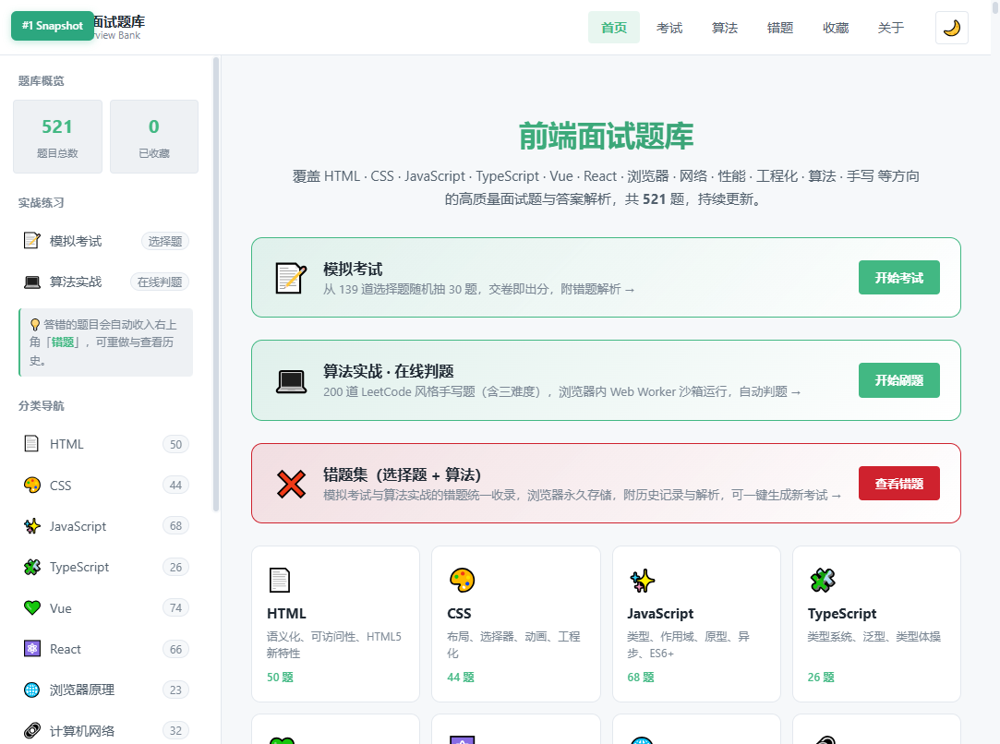

### 🔍 关键词搜索（如：闭包）

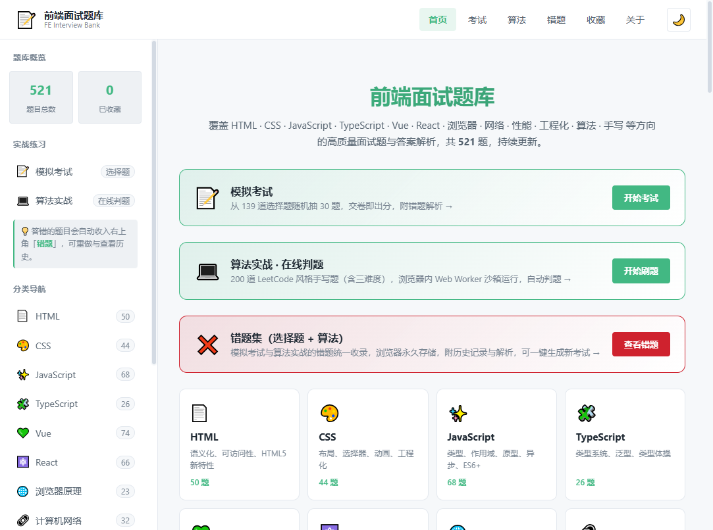

### 📚 分类浏览（JavaScript / Vue / React 等 15 个分类）

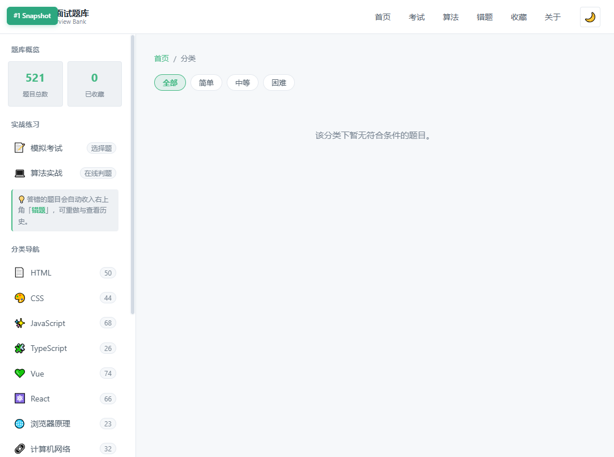

### 📄 题目详情 · 答案解析 + 代码块高亮 + 一键复制 / 在线运行

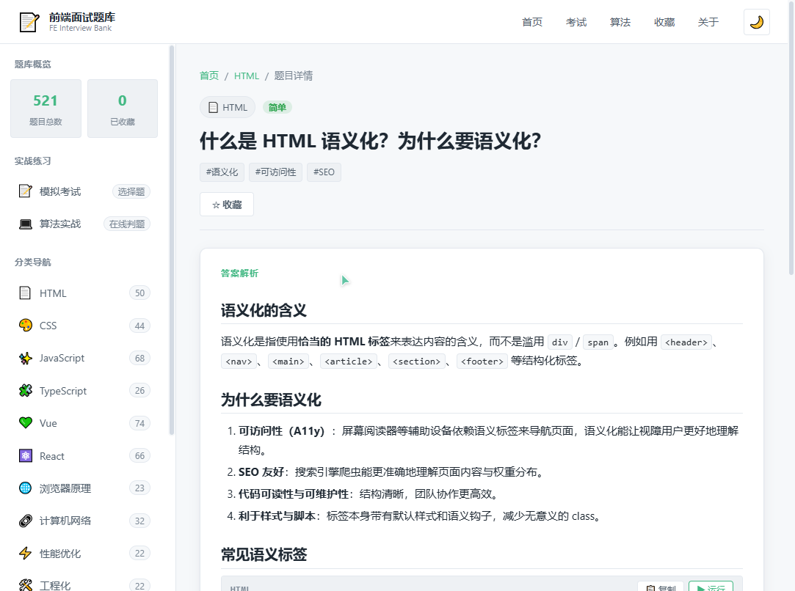

### 📝 模拟考试 · 难度模式 + 分类选择

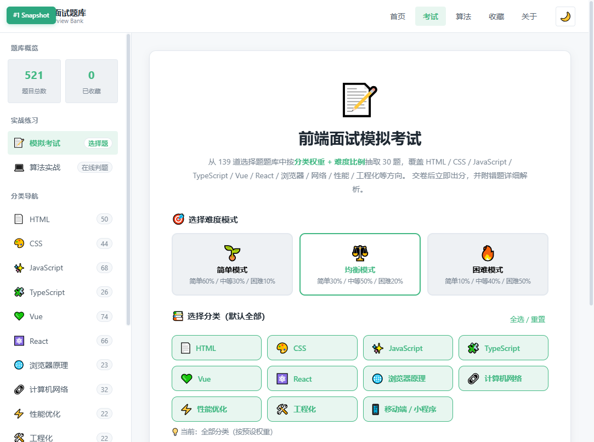

### ✅ 模拟考试 · 答题中（计时 / 题号跳转 / 标记）

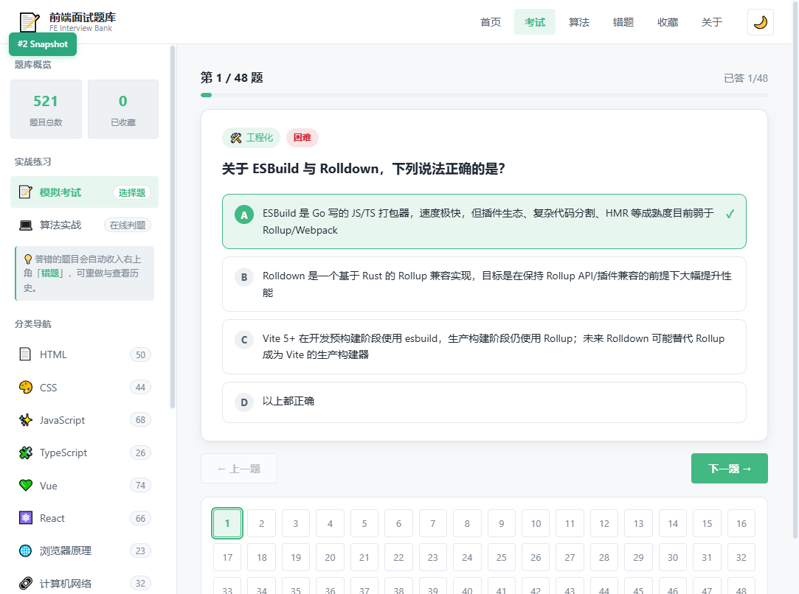

### 📊 模拟考试 · 结果页（分数 + 分类/难度分布统计 + 错题解析）

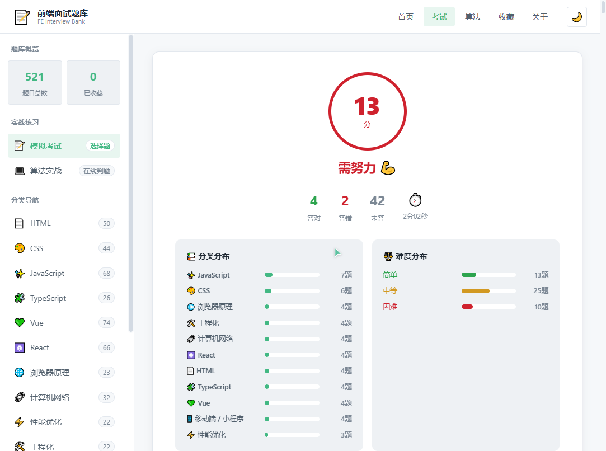

### 💻 算法实战 · 200 题三难度筛选

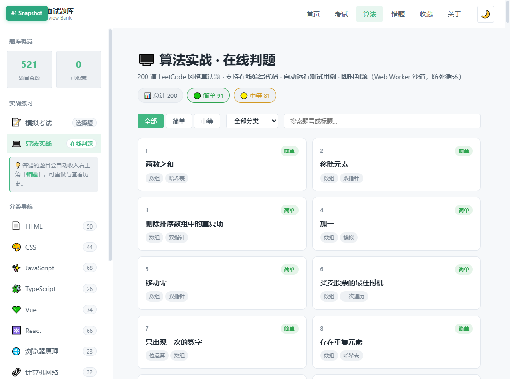

### 🧪 算法实战 · 在线判题（Web Worker 沙箱 + 题解 + 复杂度提示）

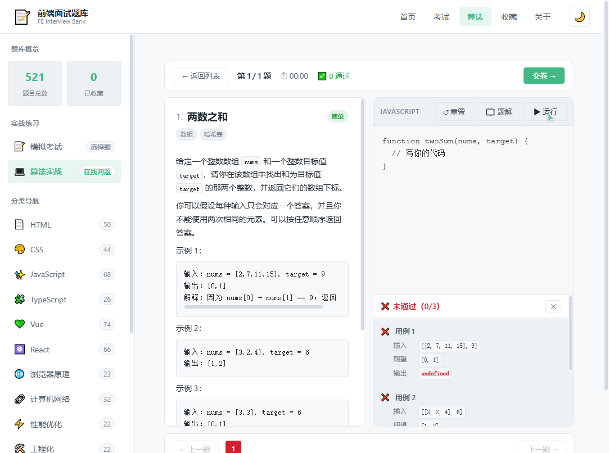

### ❌ 统一错题集 · 选择题 Tab（选项复核 + 解析 + 历史记录）

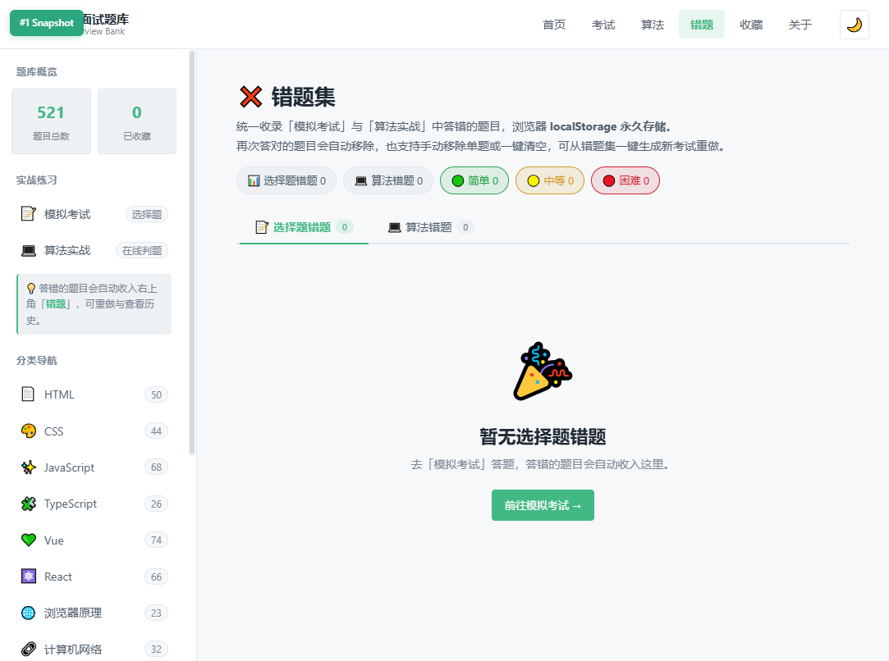

### ❌ 统一错题集 · 算法 Tab（题解 + 提交代码 + 错误信息）

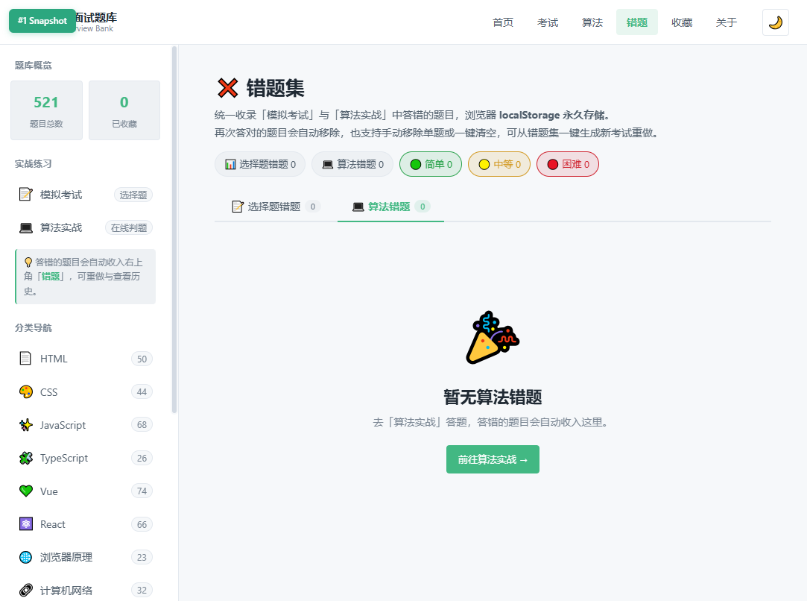

### ⭐ 我的收藏（localStorage 持久化）

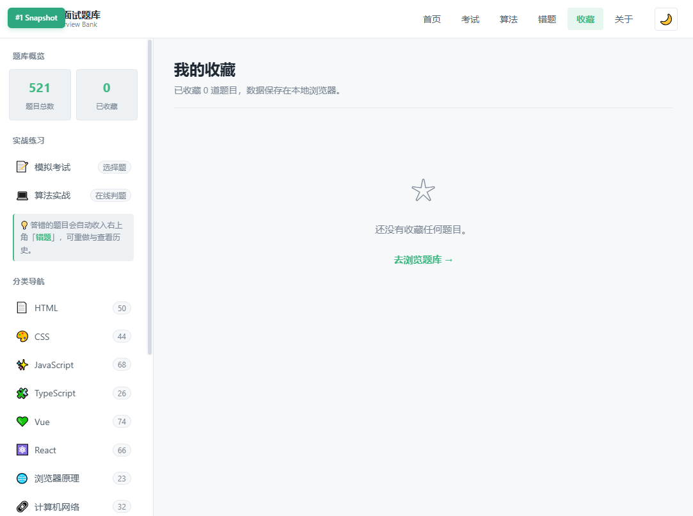

### 📖 关于页（含 GitHub 仓库地址与作者信息）

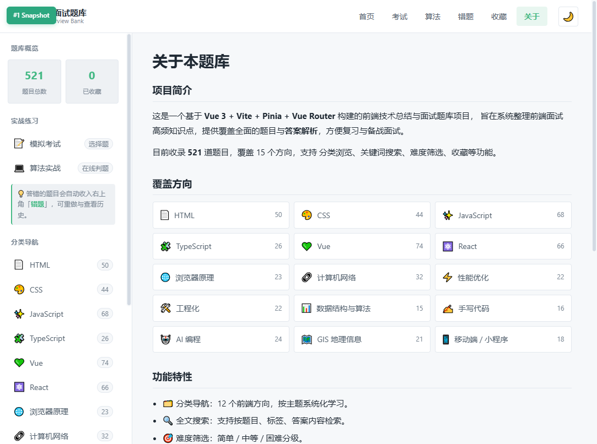

### 🌙 深色模式

所有页面均支持深色模式，点击右上角 🌙 / ☀️ 一键切换，CSS 变量统一换肤。

---

## 🗂️ 题库覆盖（514 题）

| 分类 | 数量 | 核心主题 |
| --- | ---: | --- |
| 🟧 HTML | 50 | DOM、语义化、SEO、meta、表单、ARIA、响应式图片、Web Components、CSP/SRI、fetchpriority |
| 🎨 CSS | 44 | 盒模型、BFC、Flex/Grid、动画、响应式、CSS 变量、伪类/伪元素、清除浮动、隐藏元素、逻辑属性、@layer、@property、:has/@scope/@container、滚动捕捉、堆叠上下文、遮罩混合模式 |
| 🟨 JavaScript | 68 | 数据类型、闭包、原型链、this、事件循环、Promise、ES6+、模块化、防抖节流、FP、GC、正则、ES2021+、BigInt、Intl、迭代器生成器、Proxy/Reflect、结构化克隆、事件委托 |
| 🔷 TypeScript | 26 | 类型系统、接口、泛型、类型守卫、条件类型、infer、工具类型、映射类型、模板字面量类型 |
| 🟢 Vue 3 | 74 | 响应式原理、组合式 API、Pinia、Router、编译优化、Composables、编译器、SSR、diff、调度器、defineModel、自定义渲染器、自定义指令、VueUse、SFC 编译 |
| 🟦 React | 66 | Hooks、Fiber、状态管理、性能优化、React 18/19、并发渲染、Suspense、Server Components、useTransition、React Compiler、Custom Hook 模式、Zustand/Jotai |
| 🧭 浏览器原理 | 23 | 渲染流水线、事件循环、存储、同源策略、跨域、WebAssembly、Service Worker、Cookie SameSite、XSS/CSRF 进阶、浏览器指纹、COOP/COEP、BFCache、Observer 系列 |
| 🌐 计算机网络 | 32 | HTTP/HTTPS、缓存、TCP、CORS、状态码、HTTP/2/3、QUIC、TLS 1.3、OAuth2/OIDC、证书链+HSTS、gRPC/Protobuf、CDN、DNS、**WebSocket 握手/帧格式/掩码**、Ping/Pong、心跳重连指数退避、SSE 与 EventSource、Socket.IO/Engine.IO、WS 跨域鉴权与混合内容、permessage-deflate 压缩、二进制 Protobuf、广播风暴与 Redis Adapter、故障排查与 Nginx 坑 |
| ⚡ 性能优化 | 22 | Core Web Vitals、懒加载、防抖节流、构建优化、监控、长任务、Web Worker 优化、内存泄漏、INP、骨架屏、图片优化进阶（AVIF）、打包体积优化 |
| 🏗️ 工程化 | 22 | 模块系统、Webpack/Vite、CI/CD、Monorepo、代码规范、Vite vs Webpack 原理、ESBuild/Rolldown、微前端方案、PWA、错误监控与性能埋点、灰度发布与 A/B 测试 |
| 🧮 数据结构与算法 | 15 | 排序、二分、栈队列、链表、二叉树、动态规划、贪心 |
| ✍️ 手写代码 | 16 | 防抖节流、深拷贝、Promise、call/apply/bind、发布订阅 |
| 🤖 AI 编程 | 24 | AI 辅助编程、Agent、RAG、提示工程、MCP 协议、Vibe Coding |
| 🗺️ GIS 地理信息 | 41 | GeoJSON、坐标系纠偏、瓦片、Turf.js、OpenLayers、Mapbox/MapLibre、Leaflet、Cesium、Three.js、Deck.gl（分类页按框架分组） |
| 📱 移动端 / 小程序 | 18 | iOS/Android H5 兼容、viewport 与 100dvh、rem/vw/px-to-viewport 适配、微信小程序双线程与 setData、生命周期、分包、自定义组件、登录/unionid、web-view/跳转、uni-app 条件编译与 nvue、Taro 编译原理、Hybrid JSBridge、手势、跨端选型、uniCloud/easycom/uni-id |

### 📝 模拟考试题库（138 道选择题 · 全部带难度分级）

独立的单选题库（结构：`category / difficulty / question / options / answer / analysis`），覆盖 11 个核心分类，每次从 138 道中**按预设权重 + 难度比例**抽取 30 题：

| 分类 | 数量 | 分类 | 数量 |
| --- | ---: | --- | ---: |
| JavaScript | 19 | 浏览器原理 | 9 |
| CSS | 17 | 计算机网络 | 17 |
| Vue | 14 | 性能优化 | 9 |
| HTML | 12 | 工程化 | 8 |
| React | 12 | 移动端/小程序 | 10 |
| TypeScript | 11 | | |

**考试进阶配置：**
- 🎚️ **难度模式**：简单（60/30/10）、均衡（30/50/20，默认）、困难（10/40/50）
- 🗂️ **分类选择**：可选 1 个或多个分类重点练习（权重自动归一化）
- 📊 **分布统计**：结果页展示「分类分布」+「难度分布」条形图，直观了解知识结构

### 💻 算法实战题库（200 道手写题 · 三档难度 · LeetCode 风格）

独立的手写算法题库（结构：`no / title / difficulty / tags / desc / functionName / starterCode / setup / testCases / solution / timeComplexity / spaceComplexity`），覆盖**简单 / 中等 / 困难三档难度**与主流算法分类，浏览器内 **Web Worker 沙箱**直接运行用户代码，无需后端：

| 分类 | 题量 | 代表题目 |
| --- | ---: | --- |
| 数组 | 25+ | 两数之和、三数之和、最大子数组和、合并区间、买卖股票最佳时机、螺旋矩阵 |
| 字符串 | 18+ | 最长回文子串、有效括号、字符串相加、反转单词、KMP、回文子串计数 |
| 数学 / 哈希 | 18+ | 素数筛、最大公约数、快速幂、快乐数、Excel 表列名 |
| 栈 / 队列 | 12+ | 用栈实现队列、每日温度、最小栈、括号匹配、单调栈 |
| 二分 / 查找 | 12+ | 二分查找、搜索旋转数组、第 K 大元素、寻找峰值 |
| 排序 | 10+ | 合并区间、颜色分类、前 K 个高频元素、数组中的第 K 个最大元素 |
| 动态规划 | 25+ | 爬楼梯、零钱兑换、最长递增子序列、不同路径、编辑距离、最长公共子序列 |
| 滑动窗口 / 双指针 | 12+ | 无重复字符的最长子串、盛最多水的容器、最小覆盖子串 |
| 回溯 / 全排列 | 14+ | 全排列、子集、N 皇后、组合总和、单词搜索、解数独 |
| 链表 | 13+ | 反转链表、合并有序链表、环形链表、LRU 缓存、两数相加、删除倒数第 N 个节点 |
| 树 / 二叉树 | 15+ | 二叉树层序遍历、最大深度、最近公共祖先、验证二叉搜索树、路径总和、序列化 |
| 图 / 并查集 | 8+ | 岛屿数量、课程表、朋友圈、单词接龙 |

**算法实战特性：**
- 🧪 **在线判题**：用户代码在浏览器 **Web Worker** 沙箱中执行，主线程不受阻塞，5 秒超时保护。
- ✅ **测试用例自动比对**：深比较输出与期望，逐条标记「通过/失败」，附失败输入与期望/实际对照。
- 🔁 **输入/输出序列化**：自动处理数组 / 链表 / 二叉树等数据结构的字符串转换，无需手写 parse。
- 📋 **题解 + 复杂度**：每题附 Markdown 思路解析、时间复杂度、空间复杂度提示。
- 🎯 **答题进度**：状态机管理 `idle → taking → result` 三态，支持题目间切换、保存草稿、统一提交。
- 📱 **响应式分屏**：桌面端左右分屏（题目描述 + 代码编辑器），移动端上下堆叠。
- ⌨️ **快捷键**：`Tab` 自动缩进、`Ctrl/Cmd + Enter` 运行全部用例。

### ❌ 统一错题集（选择题 + 算法 / 浏览器永久存储）

位于**右上角导航「错题」入口**（不在侧边栏），自动收录「模拟考试」与「算法实战」中答错的题目，分别存储于浏览器 **`localStorage`**（键：`exam-wrong-questions-v1` 与 `algo-wrong-questions-v1`），刷新或重启浏览器后仍在。页面顶部 Tab 切换两种类型：

| 能力 | 说明 |
| --- | --- |
| 🗳 **自动收录** | 「模拟考试」交卷时未答对的选择题 / 「算法实战」运行未通过的算法题，各自自动加入对应错题集 |
| ✅ **自动移除** | 同一题在后续任意一次考试中「答对」即自动移出错题集（形成错题 → 重做 → 掌握闭环） |
| 📜 **历史答题记录** | 每题保留**最近 10 次**答题记录：选择题记录「你的选择 / 正确答案」，算法题记录「用时 / 失败用例 / 提交代码 / 执行错误」 |
| 💡 **解析 / 题解** | 选择题错题卡片直接展示选项对照与解析；算法错题卡片可展开查看 Markdown 题解（思路 + 代码） |
| 🎯 **从错题生成考试** | 一键将错题集打乱（Fisher-Yates 洗牌）生成新考试，选择题最多 30 题、算法最多 20 题，重做错题 |
| 🗑 **手动移除 / 清空** | 支持单题移除（✕ 按钮）与一键清空全部错题（两个 Tab 各自独立） |
| 🎚 **难度筛选** | 全部 / 简单 / 中等 / 困难 切换查看，附按难度统计的 Pill 标签 |
| 🔢 **导航徽标** | 顶部 Header「错题」入口实时显示选择题 + 算法错题总数 |
| 💾 **持久化** | localStorage 永久存储，版本化 key 便于后续迁移 |

---

## 🛠️ 技术栈

| 技术 | 用途 |
| --- | --- |
| Vue 3（`<script setup>` + Composition API） | UI 框架 |
| Vite 5 | 构建工具 / 开发服务器 |
| Pinia | 状态管理（题目、搜索、收藏、考试、算法实战、选择题错题集、算法错题集） |
| Vue Router 4 | 路由（开发 WebHistory / 生产 HashHistory，兼容 EXE 的 file://） |
| Marked + highlight.js | Markdown 渲染 + 代码块语法高亮 |
| Web Worker | 算法实战在线判题的沙箱执行环境 |
| Electron 30 + electron-builder 24 | 打包成 Windows .exe（安装包 + 免安装便携版） |

---

## 🚀 快速开始

> ⚠️ Windows 若遇到「禁止运行脚本」（PowerShell 执行策略），先执行：
> ```powershell
> Set-ExecutionPolicy -Scope CurrentUser RemoteSigned
> ```
>
> 💡 **国内安装 / 打包慢？** Electron 二进制下载需要走国内镜像，详见下方「Electron 桌面 EXE 模式」一节的镜像配置。

### 1. 浏览器模式（推荐日常使用）

```bash
# 安装依赖
npm install

# 启动开发服务器（默认 http://localhost:5173）
npm run dev

# 构建生产版本到 dist/
npm run build

# 本地预览构建产物
npm run preview
```

启动后浏览器访问 **http://localhost:5173/** 即可使用。

### 2. Electron 桌面 EXE 模式（Windows 可双击运行）

> ⚠️ **首次打包前必读**：electron-builder 需要从镜像下载 Electron 二进制（约 110MB）与 NSIS 工具。**国内网络必须配置镜像**，否则会卡在 `github.com` 超时。
>
> 项目提供了一键配置脚本（设置国内镜像 + 把缓存重定向到项目内 `.electron-cache/`，避免沙箱/权限问题）：
>
> ```powershell
> # Windows / PowerShell（当前会话生效）
> .\scripts\set-electron-env.ps1
> # 永久写入用户环境变量（重启终端仍生效）
> .\scripts\set-electron-env.ps1 -Persist
> ```
>
> ```bash
> # macOS / Linux / Git Bash
> source ./scripts/set-electron-env.sh
> ```
>
> 等价的手动配置（如不想用脚本）：
> ```bash
> set ELECTRON_MIRROR=https://npmmirror.com/mirrors/electron/
> set ELECTRON_BUILDER_BINARIES_MIRROR=https://npmmirror.com/mirrors/electron-builder-binaries/
> set ELECTRON_CACHE=<项目根目录>\.electron-cache   # 可选，避免沙箱/权限问题
> ```

```bash
# ① 安装依赖（首次需要）
npm install

# ② 本地开发预览：同时启动 Vite + Electron 客户端窗口
npm run dev:electron

# ③ 打包「安装版 + 免安装便携版」双产物到 release/
npm run dist:win
# 产物：
#   release/前端面试题库-1.0.0-x64-win.exe        → NSIS 安装程序（可选安装目录 + 桌面快捷方式）
#   release/前端面试题库-1.0.0-x64-portable.exe   → 免安装便携版，双击即可使用

# ④ 仅打包免安装便携版（推荐，体积小、即开即用）
npm run dist:win:portable

# ⑤ 仅打包目录（不生成安装包，快速查看 asar 结构）
npm run pack
```

> **注意**：打包命令会自动先执行 `npm run build` 生成 `dist/`，再由 electron-builder 打包为 EXE。无需手动两步。

#### ✅ 已验证产物（2026-08-17 实测）

| 命令 | 产物 | 体积 | 启动测试 |
| --- | --- | ---: | --- |
| `npm run pack` | `release/win-unpacked/前端面试题库.exe` + 依赖目录 | 168.8 MB | ✅ 进程正常，主窗口标题"前端面试题库" |
| `npm run dist:win:portable` | `release/前端面试题库-1.0.0-x64-portable.exe`（NSIS 自解压单文件） | 70.4 MB | ✅ 双击启动正常，多进程架构（主+GPU+渲染）均运行 |
| `npm run dist:win` | 同时生成 NSIS 安装包 + portable | 约 70 MB+ | ✅ 同上 |

> 首次打包会下载 Electron 二进制（~110MB）和 NSIS 工具（~2MB）到 `.electron-cache/`，后续打包复用缓存，速度大幅提升。

---

## 📁 项目结构

```
.
├── electron/                   # ⚡ Electron 主进程与 preload
│   ├── main.js                 #   主进程：窗口管理 / 开发加载 Vite :5173 / 生产加载 dist
│   └── preload.js              #   预加载：安全桥接 API
├── build/                      # EXE 打包资源（icon.png 可放此处自定义图标）
├── screenshots/                # 🖼️ README 运行截图（13 张实拍）
├── public/                     # 静态资源（favicon 等）
├── scripts/                    # ⚙️ 工具脚本目录
│   ├── tests/                  #   调试与临时代码片段（git 忽略）
│   ├── drafts/                 #   题目草稿 txt（git 忽略）
│   ├── legacy/                 #   历史追加脚本（git 忽略）
│   ├── validate-data.mjs       #   🧪 题库数据校验（必跑）
│   ├── set-electron-env.ps1    #   ⚡ Electron 国内镜像 + 缓存目录一键配置（PowerShell）
│   ├── set-electron-env.sh     #   ⚡ 同上（Bash / macOS / Linux / Git Bash）
│   ├── insert-vue.cjs          #   Vue 题目批量插入辅助
│   ├── insert-react.cjs        #   React 题目批量插入辅助
│   ├── ts-helper.mjs           #   TS 题目插入辅助
│   ├── gen-ts-questions.mjs    #   TS 题目生成
│   └── append-ts-questions.mjs #   TS 题目追加
├── .electron-cache/            # Electron 二进制缓存（git 忽略，首次打包自动生成）
├── src/
│   ├── main.js                 # 应用入口
│   ├── App.vue                 # 根组件（Header + Sidebar + RouterView）
│   ├── router/index.js         # 路由配置（首页 / 分类 / 题目 / 收藏 / 考试 / 算法实战 / 错题集 / 关于）
│   ├── stores/
│   │   ├── questions.js       # Pinia store：题目 / 搜索 / 收藏
│   │   ├── exam.js            # 考试状态管理（idle / taking / result 三态）
│   │   ├── algorithmExam.js   # 算法实战状态管理（题目列表 / 用户代码 / 判题结果）
│   │   ├── wrongQuestions.js  # 算法错题集 store（localStorage 持久化 / 历史记录 / 生成考试）
│   │   └── examWrongQuestions.js # 选择题错题集 store（localStorage 持久化 / 历史记录 / 生成考试）
│   ├── composables/useTheme.js # 主题（深色模式）
│   ├── utils/markdown.js       # Markdown + 代码块（高亮/复制/运行）封装
│   ├── utils/algorithmRunner.js # Web Worker 沙箱判题器（超时保护 / 输入输出转换 / 深比较）
│   ├── assets/styles/
│   │   ├── main.css            # 全局样式
│   │   └── variables.css       # CSS 变量（亮 / 暗主题）
│   ├── components/
│   │   ├── AppHeader.vue
│   │   ├── AppSidebar.vue
│   │   ├── SearchBar.vue
│   │   ├── QuestionCard.vue
│   │   ├── MarkdownContent.vue # Markdown 渲染 + 复制/运行按钮
│   │   ├── DifficultyBadge.vue
│   │   └── TagBadge.vue
│   ├── views/
│   │   ├── HomeView.vue        # 首页：概览 + 全部题目
│   │   ├── CategoryView.vue    # 分类列表
│   │   ├── QuestionView.vue    # 题目详情 + 答案解析
│   │   ├── FavoritesView.vue   # 收藏夹
│   │   ├── ExamView.vue        # 模拟考试（开始页 / 答题页 / 结果页，交卷自动同步错题集）
│   │   ├── AlgorithmExamView.vue # 算法实战（选题 / 答题 / 在线判题 / 结果，运行自动同步错题集）
│   │   ├── WrongQuestionsView.vue # 统一错题集（Tab 切换选择题/算法，列表/历史/解析/移除/生成考试）
│   │   └── AboutView.vue       # 关于
│   └── data/                   # 📚 题库数据（可持续扩充）
│       ├── categories.js       # 分类元信息（id/名称/图标/简介）
│       ├── html.js · css.js · javascript.js
│       ├── typescript.js · vue.js · react.js
│       ├── browser.js · network.js · performance.js
│       ├── engineering.js · algorithm.js · handwriting.js
│       ├── aicode.js           # AI 编程分类
│       ├── exam.js             # 模拟考试选择题题库（独立结构，138 题，全部带 difficulty 难度字段）
│       ├── algorithmExam.js    # 算法实战题库入口（聚合 base + part1-4，共 200 题，三档难度）
│       ├── algo_part1.js       # 算法题片段 1：数组 / 字符串 / 数学（46 题）
│       ├── algo_part2.js       # 算法题片段 2：栈队列 / 二分 / 排序（33 题）
│       ├── algo_part3.js       # 算法题片段 3：DP / 滑动窗口 / 回溯（40 题）
│       ├── algo_part4.js       # 算法题片段 4：链表 / 树 / 图（36 题）
│       └── gis.js              # GIS 地理信息分类
├── index.html
├── vite.config.js
├── jsconfig.json
├── package.json
└── README.md
```

---

## ➕ 如何添加新题目

### 1. 追加到已有分类
在 `src/data/` 下对应分类文件中，按统一结构追加对象：

```js
export const xxxQuestions = [
  {
    id: 'xxx-001',           // 唯一 ID，建议「分类缩写-序号」
    category: 'xxx',         // 与 categories.js 中 id 一致
    title: '题目标题',
    difficulty: '中等',      // 简单 | 中等 | 困难
    tags: ['标签1', '标签2'],
    answer: `## 标题
支持 **Markdown**：

\`\`\`javascript
// 代码块自带复制 & 运行
console.log('Hello')
\`\`\``
  }
  // ...
]
```

### 2. 新增一个分类
1. 在 `src/data/` 下新建 `yourCategory.js`，导出 `yourCategoryQuestions` 数组。
2. 在 [src/data/categories.js](file:///d:/code/fe-interview-bank/src/data/categories.js) 中追加分类元信息：
   ```js
   { id: 'yourcategory', name: '分类名', icon: '🔖', desc: '分类简介' }
   ```
3. 在 [src/stores/questions.js](file:///d:/code/fe-interview-bank/src/stores/questions.js) 中导入并合并：
   ```js
   import { yourCategoryQuestions } from '@/data/yourCategory'
   const allQuestions = [ ..., ...yourCategoryQuestions ]
   ```

### 3. 提交前必跑校验
```bash
node scripts/validate-data.mjs
```
校验内容：14 个数据文件能否被正确 `import`、每题的 `id/title/answer` 类型是否正确、Markdown 代码围栏是否闭合；**全部通过后再构建**。

### 4. 添加算法实战题（在线判题）

算法实战题库独立于问答题库，位于 [src/data/algorithmExam.js](file:///d:/code/fe-interview-bank/src/data/algorithmExam.js)，结构如下：

```js
export const algorithmProblems = [
  {
    id: 'algo-001',
    no: '1',                      // 显示序号
    title: '两数之和',
    difficulty: '简单',            // 简单 | 中等 | 困难
    tags: ['数组', '哈希表'],
    desc: '题目描述（支持 Markdown）',
    functionName: 'twoSum',       // 用户需实现的函数名
    starterCode: 'function twoSum(nums, target) {\n  // 写你的代码\n}',
    setup: '',                    // 可选：辅助函数 / 类型定义（如链表节点）
    testCases: [
      { input: [[2,7,11,15], 9], expected: [0,1] },
      { input: [[3,2,4], 6], expected: [1,2] }
    ],
    solution: '### 解题思路\n\n使用哈希表存储...',  // Markdown 题解
    timeComplexity: 'O(n)',
    spaceComplexity: 'O(n)'
  }
  // ...
]
```

**注意事项：**
- `testCases.input` 是数组，会作为参数依次传入用户函数（如 `twoSum(...input)`）。
- 链表 / 二叉树等复杂数据结构请在 `setup` 中提供构造函数，判题器会自动调用反序列化。
- 判题器位于 [src/utils/algorithmRunner.js](file:///d:/code/fe-interview-bank/src/utils/algorithmRunner.js)，使用 **Web Worker** 沙箱执行，**5 秒超时保护**。

---

## 📝 说明

- 题库内容为内置数据，**纯前端项目**，无后端依赖。
- 收藏 / 主题偏好 / **选择题错题集 / 算法错题集**均保存在浏览器 `localStorage`，清理浏览器数据会丢失。
- 代码「在线运行」功能为浏览器内沙盒执行，JS 支持 `async/await`，HTML/CSS 在同源 iframe 预览，保证隔离性。
- 算法实战判题功能基于 **Web Worker**，用户代码运行在独立线程，5 秒超时保护，主线程不受阻塞。
- **统一错题集**会在「模拟考试」交卷或「算法实战」运行后自动收录答错的题目，再次答对自动移除；可在右上角「错题」入口按 Tab 切换查看，也可一键生成新考试重做错题。
- 内容仅供学习交流使用，欢迎补充与指正。

## 🤝 贡献与反馈

- 🐙 项目仓库：<https://github.com/jycao2/fe-interview-bank>
- 👤 作者：<https://github.com/jycao2>
- 📩 欢迎通过 Issue 反馈问题或提交 PR 补充题目。如本项目对您有帮助，欢迎点个 ⭐ Star！

## License

MIT
